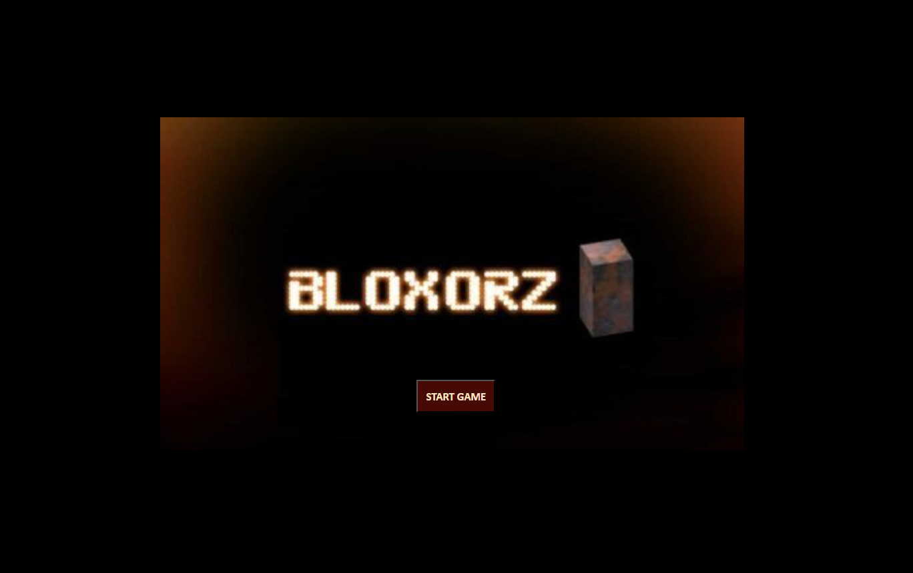

# Bloxorz

### Description
Bloxorz is a classic puzzle game. In this game, players control a rectangular block, navigating it through a series of tiles with the goal of reaching the destination tile. Along the way, they must avoid falling off the edges and strategically maneuver around obstacles to progress to the next level.

### Gameplay
- Players control the movement of the block using arrow keys or swipe gestures, depending on the platform.
- The block can move horizontally or vertically but cannot be rotated.
- Tiles may have different properties, including normal tiles, movable tiles, hole tiles, and death tiles.
- Movable tiles are the one on which block can move on, while death tiles result in instant failure if the block falls onto them.
- The game progresses through currently five levels, each with increasing complexity and challenges.

### How to Play
- Use the arrow keys or swipe gestures to move the block.
- Navigate the block through the level, avoiding falling off the edges or landing on death tiles.
- Reach the destination tile to complete each level.

### Motivation
The Project blends elements of the iconic Snake game with the mechanics of the original Bloxorz game. The aim was to create something that is not there in the market.

### Future Scope
- **Multiplatform Compatibility:** Expand the game to support various platforms to reach a broader audience.
- **Multiplayer Mode:** Implement multiplayer mode, enabling players to compete against each other or collaborate in solving puzzles together.
- **Add More levels and a Timer:** Increase the number of levels and add a timer so that a high score can be mantained.
- **Enhanced Graphics and Visuals:** Improve the game's graphics and visual effects to create a more immersive and visually appealing gaming experience.

### Tech Stack
 
 
 
